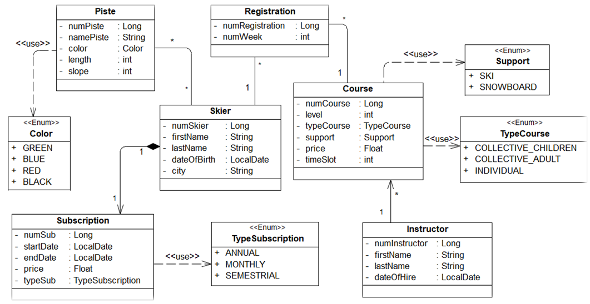

# Spring Boot - Academic project
For 4th year classes (engineering degree): ESPRIT engineering school

## Class Diagram




## Requirements

For building and running the application you need:

- [JDK 1.8](http://www.oracle.com/technetwork/java/javase/downloads/jdk8-downloads-2133151.html)

## Description for GitHub Repo Link - DevOps Project:
<br>
Welcome to the GitHub repository of my DevOps project, a culmination of my academic endeavor in the field of development operations management. This project represents a comprehensive implementation of key DevOps concepts and tools, successfully deployed to automate and optimize software development processes.

<br>

## Description pour le Lien du Repo GitHub - Projet DevOps :
<br>
Bienvenue sur le référentiel GitHub de mon projet DevOps, fruit de mon engagement académique dans le domaine de la gestion des opérations de développement. Ce projet représente une mise en œuvre complète des principaux concepts et outils DevOps, déployés avec succès pour automatiser et optimiser les processus de développement logiciel.
<br>


## Project Highlights:

🚀 DevOps Automation: Successful integration of DevOps practices to enhance collaboration between development and operations teams.<br>
🛠️ CI/CD (Continuous Integration / Continuous Deployment): Implementation of a CI/CD pipeline for fast and reliable development cycles.
🐳 Docker: Advanced use of Docker for application containerization and efficient environment management.
📊 Monitoring with Grafana and Prometheus: Configuration of Grafana and Prometheus to monitor and analyze system performance.
🔄 Version Control with Git: Tracking changes and effective collaboration using Git.
📦 Artifact Management with Nexus: Utilization of Nexus for centralized management of artifacts and deliverables.
🛡️ Unit Testing with JUnit: Establishment of unit tests with JUnit to ensure code quality.

## Caractéristiques du Projet :


🚀 Automatisation DevOps : Intégration réussie de pratiques DevOps pour améliorer la collaboration entre les équipes de développement et d'opérations.
🛠️ CI/CD (Intégration Continue / Déploiement Continu) : Mise en place d'un pipeline CI/CD pour des cycles de développement rapides et fiables.
🐳 Docker : Utilisation avancée de Docker pour la conteneurisation des applications et la gestion efficace des environnements.
📊 Surveillance avec Grafana et Prometheus : Configuration de Grafana et Prometheus pour surveiller et analyser les performances du système.
🔄 Gestion de Versions avec Git : Suivi des changements et collaboration efficace avec Git.
📦 Gestion des Artefacts avec Nexus : Utilisation de Nexus pour la gestion centralisée des artefacts et des livrables.
🛡️ Tests Unitaire avec JUnit : Mise en place de tests unitaires avec JUnit pour garantir la qualité du code.

## Comment Contribuer :

📥 Clonez le dépôt localement.
🚀 Explorez le code source pour comprendre l'architecture et les fonctionnalités DevOps mises en œuvre.
🐛 Identifiez des problèmes ou proposez des améliorations en ouvrant une issue.
🛠️ Contribuez en soumettant des pull requests avec des descriptions détaillées des modifications apportées.
Remarque : N'hésitez pas à consulter les documents de référence inclus pour comprendre les critères évalués tout au long du projet DevOps.

Explorez, contribuez et merci de faire partie de cette démarche DevOps ! 🌐✨

## Running the application locally

There are several ways to run a Spring Boot application on your local machine.
One way is to execute the `main` method in the `tn.esprit.SkiStationProject.SkiStationProjectApplication` class from your IDE.

Alternatively you can use the [Spring Boot Maven Wrapper plugin](https://maven.apache.org/wrapper/) like so:

```shell
./mvnw spring-boot:run
```
## Browser URL
Open your browser at the following URL for Swagger UI (giving REST interface details):

http://localhost:9090/swagger-ui/index.html 

